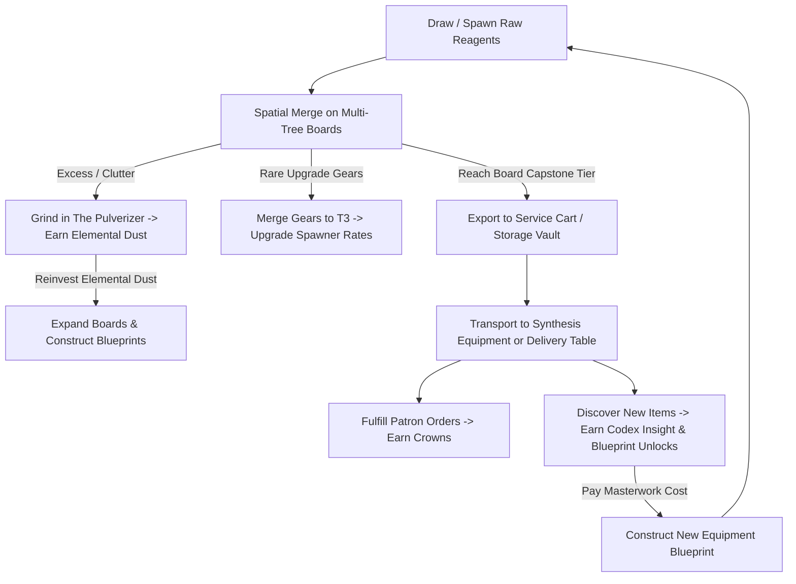

# Transmute — Project Vision & Master Overview

## 1. Game Concept & Vision
**Transmute** is a web-first, spatial-management merge puzzle game set in an antique, atmospheric alchemist workshop. 

Unlike traditional mobile merge games that rely on energy timers, narrative dialogue trees, or cosmetic mansion-decorating minigames, **Transmute is a pure spatial puzzle and engine-building experience**. 

The core challenge comes from **multi-tree board crowding, strict export thresholds, equipment specialization, and deliberate material pulverization**. Spatial pressure should be felt immediately — even the player's very first board features two distinct material families competing for space.

### Core Pillars
1. **Spatial Management is the Puzzle:** Board space is always tight and precious. Success is determined by clever space planning, recognizing when to pulverize vs. merge, and juggling multiple material families on the same grid.
2. **No Timers, No Move Limits:** Players can think, plan, and execute at their own pace without arbitrary stamina/energy gates or artificial move countdowns.
3. **Equipment as Specialized Boards:** Instead of a single giant chaotic board, players operate distinct pieces of equipment (workbenches, alembics, crucibles).
   - **Multi-Tree Boards:** Primary boards hold two distinct material families (e.g. Flora and Fungi).
   - **The Capstone Export Rule:** Items follow a strict $\text{T1} \rightarrow \text{T4}$ merge chain and **cannot leave the board until they reach their T4 capstone tier**.
   - **Synthesis Equipment:** Advanced multi-input machines accept these exported capstones to craft composite elixirs and alloys.
4. **Meaningful Sacrifice (The Pulverization Economy):** Discarding items is never wasted effort. Every board features an integrated **The Pulverizer** where unwanted items are ground into **Elemental Dust** (a single untyped currency). 
   - Elemental Dust is stored in the player's **Alchemical Ledger (wallet)**, never occupying physical tiles.
   - Elemental Dust is reinvested into expanding board dimensions and paying Blueprint construction costs.
5. **Patron Orders as the Tactical Heartbeat:** Rotating **Patron Orders** give players short-term crafting targets that direct moment-to-moment decision-making. 
6. **Blueprints over Rooms:** Long-term progression is driven by the **Grand Codex**. Discovering new items in the Codex unlocks **Equipment Blueprints**. The player then pays a massive material cost (the **Masterwork**) to construct the Blueprint and add it to their UI tabs.
7. **Cross-Platform Static Web:** Playable seamlessly on desktop and mobile browsers as a fast, zero-install static web application.

---

## 2. Core Gameplay Loop

---

## 3. Economy & Currency Architecture

| Currency | Primary Source | Primary Sink | Purpose in Loop | Storage Method |
| :--- | :--- | :--- | :--- | :--- |
| **Elemental Dust** | Grinding items in The Pulverizer | Grid tile expansions, Storage Vault slots, Blueprint Masterwork costs | Relieves spatial pressure and powers local board growth | **Alchemical Ledger** (Global wallet) |
| **Insight** | First-time Codex entries | Unlocking advanced Vault upgrades | Gating macroscopic progression | **Grand Codex** |
| **Crowns** | Fulfilling voluntary patron orders | Purchasing Codex reagent buy-backs | Directs short-term crafting targets and economic flow | **Workshop Coffer** (Global wallet) |

---

## 4. Documentation Architecture

The design of **Transmute** is split across modular documents to allow focused, incremental planning:

- `00_OVERVIEW_AND_VISION.md` (This file): Master vision, core loop, and constraints.
- `01_ROOMS_AND_EQUIPMENT.md`: Equipment blueprints, starting grid sizes, multi-tree pairings, and UI groupings.
  - *Resolved:* Rooms as progression gates have been replaced by Blueprint Construction. Primary boards hold two material families to ensure spatial pressure.
- `02_MATERIALS_AND_MERGE_TREES.md`: Elemental trees, tier scaling (T1–T4 primary, T5–T8 synthesis), and Spawner Upgrade Mechanics.
  - *Resolved:* Spawners drop rare Mechanism Gears that must be merged to T3 to upgrade drop rates. Yield formulas for Dust are strictly progressive.
- `03_STORAGE_AND_LOGISTICS.md`: The Service Cart, Storage Vault, capstone validation, item stacking limits, and cross-board transfer UX.
  - *Resolved:* Cart starts at 2 slots (expands to 5), Vault stack limits scale organically, and capstone export is enforced via red-lock visual rejection.
- `04_CODEX_AND_MASTERWORKS.md`: The Grand Codex, passive research perks, Masterwork costs, Patron Order system, and content expansion guide.
  - *Resolved:* Patron Orders use a 3-slot board (Standard, Complex, Commission). Rerolling costs 50 Dust. Masterworks are the material costs paid to construct equipment Blueprints.
- `05_TECHNICAL_SPEC_AND_UX.md`: Static web architecture, state management, save schema, and mobile/desktop responsive design.
  - *Resolved:* UI wireframes updated to reflect minimal workspace tabs; save schema updated for Multi-Tree boards with dual spawners.

---

## 5. Instructions for Future AI Planning Sessions

When working on any task for Transmute:
1. **Respect Core Pillars:** Never introduce real-time timers, stamina energy gates, or narrative-heavy dialogue cutscenes. Keep the focus on spatial mechanics, discovery, and engine building.
2. **Enforce the Capstone Rule:** Never allow sub-capstone items to be exported from primary equipment boards into shared storage or other primary boards.
3. **Respect the Pulverization Economy:** Sacrificing items yields Elemental Dust via The Pulverizer, stored in the global wallet without occupying board space.
4. **Consult Cross-References:** Before editing a document, verify how its values interact with the other documents.
5. **Maintain Static Simplicity:** Every mechanic designed must be implementable in a client-side static web environment (HTML/CSS/JS or lightweight canvas/SVG) with `localStorage` persistence.
