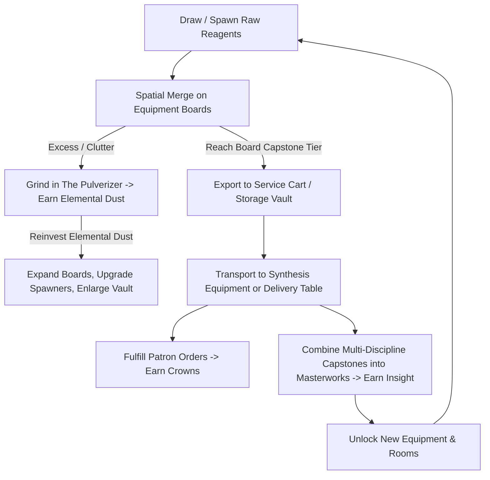

# Transmute — Project Vision & Master Overview

## 1. Game Concept & Vision
**Transmute** is a web-first, spatial-management merge puzzle game set in an antique, atmospheric alchemist workshop. 

Unlike traditional mobile merge games that rely on energy timers, narrative dialogue trees, or cosmetic mansion-decorating minigames, **Transmute is a pure spatial puzzle and engine-building experience**. 

The core challenge comes from **restricted board space, strict export thresholds, equipment specialization, and deliberate material pulverization**. Spatial pressure should be felt immediately — even the player's very first board should feel tight enough that pulverization and merge planning matter from the opening minutes.

### Core Pillars
1. **Spatial Management is the Puzzle:** Board space is always tight and precious. Success is determined by clever space planning, recognizing when to pulverize vs. merge, and managing throughput across specialized workbenches.
2. **No Timers, No Move Limits:** Players can think, plan, and execute at their own pace without arbitrary stamina/energy gates or artificial move countdowns.
3. **Equipment as Specialized Boards:** Instead of a single giant chaotic board, players operate distinct pieces of equipment (workbenches, alembics, crucibles) across workshop rooms.
   - **The Capstone Export Rule:** Items on primary equipment boards follow a strict $\text{T1} \rightarrow \text{T4}$ merge chain and **cannot leave the board until they reach their T4 capstone tier** (e.g., Tier 4 *Concentrated Extract*, *Pure Ingot*). Items can only leave once they hit T4, which prevents low-tier clutter from polluting shared storage.
   - **Synthesis Equipment:** Advanced multi-input machines (e.g., *Infusion Cauldron*, *Grand Opus Hearth*) accept these exported capstones from different disciplines to craft composite masterworks and elixirs.
4. **Meaningful Sacrifice (The Pulverization Economy):** Discarding items is never wasted effort. Every board features an integrated **The Pulverizer** where unwanted or excess ingredients are ground into **Elemental Dust** (a single untyped currency). 
   - Elemental Dust is stored in the player's **Alchemical Ledger (wallet)**, never occupying physical board tiles.
   - Elemental Dust is reinvested into expanding board dimensions, upgrading inventory stacks, and enhancing equipment.
5. **Patron Orders as the Tactical Heartbeat:** Rotating **Patron Orders** from merchants, scholars, and adventurers give players short-term crafting targets that direct moment-to-moment decision-making. Orders should vary in complexity and reward, creating a constant pull of *"do I fulfill this easy order for quick Crowns, or hold my capstones for the expensive one?"*
6. **Collection & Masterworks over Story:** Long-term progression is driven by the **Grand Codex** (cataloging all elemental tiers and secret transmutations for permanent perks) and **Milestone Masterworks** (complex multi-equipment composite crafts that unlock new rooms and machinery).
7. **Escalating Challenge through Complexity, Not Timers:** Difficulty rises organically as players unlock new rooms and equipment. More boards means more merge trees competing for the same Cart/Vault space, tighter spatial management, and Masterworks that demand increasingly exotic cross-discipline combinations.
8. **Cross-Platform Static Web:** Playable seamlessly on desktop (mouse drag-and-drop/clicks) and mobile browsers (responsive touch controls) as a fast, zero-install static web application.

---

## 2. Core Gameplay Loop

1. **Spawn & Local Merge:** Players generate basic reagents on specific equipment boards (e.g., Seeds $\rightarrow$ Leaves $\rightarrow$ Buds on the Herbalist's Bench).
2. **Pulverize for Relief:** When board space is constrained, players grind excess or bottlenecked reagents in **The Pulverizer** to generate **Elemental Dust**.
3. **Export Capstones:** Once an ingredient reaches its terminal board tier (the T4 Capstone), it unlocks for transfer. The **Service Cart** is a small quick-access tray for items in immediate transit between boards; the **Storage Vault** holds surplus capstones long-term in stackable slots.
4. **Synthesize & Masterwork:** Capstones from disparate equipment are merged on advanced synthesis boards (e.g., Herbal Capstone + Mineral Capstone) to fulfill high-tier orders and craft **Milestone Masterworks**.
5. **Reinvest & Expand:** Elemental Dust, Crowns, and Insight are spent to enlarge grids, purchase higher-yield spawners, and open new wings of the workshop.

---

## 3. Economy & Currency Architecture

| Currency | Primary Source | Primary Sink | Purpose in Loop | Storage Method |
| :--- | :--- | :--- | :--- | :--- |
| **Elemental Dust** | Grinding items in The Pulverizer | Grid tile expansions, spawner re-tuners, Storage Vault slots | Relieves spatial pressure and powers local board growth | **Alchemical Ledger** (Global wallet counter; 0 grid space used) |
| **Insight / Research** | First-time Codex entries, completing Milestone Masterworks | Unlocking new rooms, blueprints, advanced synthesis equipment | Gating macroscopic progression and workshop discovery | **Grand Codex** (Global milestone tracker) |
| **Crowns** | Fulfilling voluntary patron orders and merchant commissions | Purchasing rare catalysts, base reagent crates, spawner speed/tier upgrades | Directs short-term crafting targets and economic flow | **Workshop Coffer** (Global wallet counter) |

---

## 4. Documentation Architecture

The design of **Transmute** is split across modular documents to allow focused, incremental planning:

- `00_OVERVIEW_AND_VISION.md` (This file): Master vision, core loop, and constraints.
- `01_ROOMS_AND_EQUIPMENT.md`: Room progression, equipment board grids, spawner properties, and unlock costs.
  - *Open questions:* How small should the starting board be to ensure immediate spatial pressure? What are the starting grid dimensions and how do they scale with Elemental Dust investment?
- `02_MATERIALS_AND_MERGE_TREES.md`: Elemental trees, tier scaling (T1–T4 primary, T5–T8 synthesis), drop tables, and Elemental Dust yield formulas.
  - *Open questions:* How does Elemental Dust yield scale by tier (is grinding a T3 worth more than three T1s)?
- `03_STORAGE_AND_LOGISTICS.md`: The Service Cart, Storage Vault, capstone validation, item stacking limits, and cross-board transfer UX.
  - *Resolved:* Cart starts at 2 slots (expands to 5), Vault stack limits scale by room unlock, and capstone export is enforced via red-lock visual rejection.
- `04_CODEX_AND_MASTERWORKS.md`: The Grand Codex, passive research perks, Masterwork recipes, Patron Order system, and content expansion guide.
  - *Resolved:* Patron Orders use a 3-slot board (Standard, Complex, Commission) that instantly replenishes on fulfillment. Rerolling costs 50 Dust. Masterworks are assembled via drag-and-drop in the Codex Blueprints tab until Room 4 is unlocked.
- `05_TECHNICAL_SPEC_AND_UX.md`: Static web architecture, state management, save schema, and mobile/desktop responsive design.

---

## 5. Instructions for Future AI Planning Sessions

When working on any task for Transmute:
1. **Respect Core Pillars:** Never introduce real-time timers, stamina energy gates, or narrative-heavy dialogue cutscenes. Keep the focus on spatial mechanics, discovery, and engine building.
2. **Enforce the Capstone Rule:** Never allow sub-capstone items to be exported from primary equipment boards into shared storage or other primary boards.
3. **Respect the Pulverization Economy:** Sacrificing items yields Elemental Dust via The Pulverizer, stored in the global wallet without occupying board space.
4. **Consult Cross-References:** Before editing a document, verify how its values (e.g., tier counts, currencies, grid sizes) interact with the other documents.
5. **Maintain Static Simplicity:** Every mechanic designed must be implementable in a client-side static web environment (HTML/CSS/JS or lightweight canvas/SVG) with `localStorage` persistence.
